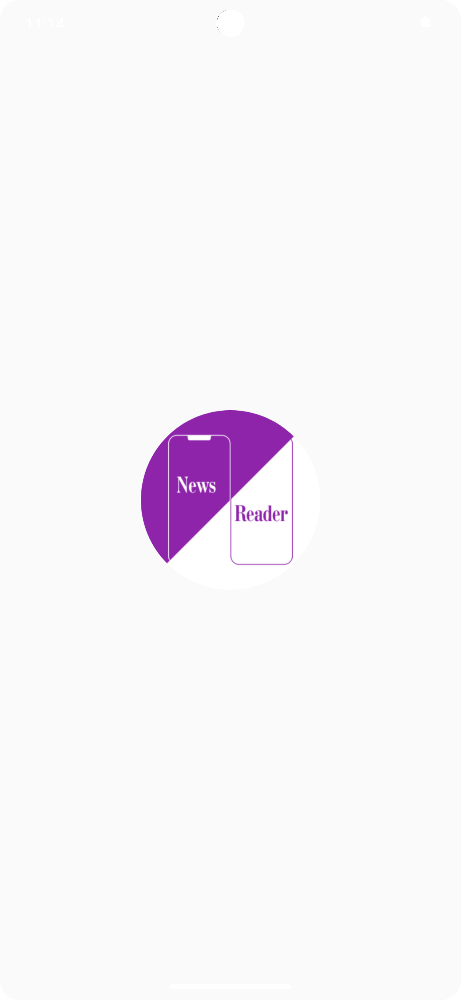

# NewsReader Android Application

## Overview
The NewsReader app, built with Jetpack Compose and Kotlin, is a user-friendly Android app for reading news. It connects to an API, ensuring it looks and feels like a native Android app while handling network errors smoothly. You can log in, register, and manage your favorite articles.

### Implemented Features

#### General
- The app perfectly embodies the Android look and feel
- Developed using Jetpack Compose for a polished user experience
- Robust error handling prevents crashes during network errors

#### Localization
- Support both light and dark modes

#### User Management
- Enable user login, logout, and registration functionalities
- Allow users to view and manage a list of favorite articles

#### Main Page
- A list of articles with the image, headline and state of like (if you are logged in)
- Lazy loading for smooth scrolling
- Simple navigation to detailed pages with a tap
- Intuitive indicators for your favorite articles
- Refresh articles on the main page 

#### Details Page
- Essential details presented elegantly, including title, summary, image, clickable full article URL, timestamp, related articles, and categories
- Explore articles in the same category with a single click

#### Other Features
- Supports English and German languages
- Enable article sharing 
- An Icon for the App

  

<table>
  <tr>
    <td align="center" width="33%">
       
      <em>Logo when starting the application</em>
    </td>
    <td align="center" width="33%">
       
      <em>Main Page with all listed articles - Darkmode</em>
    </td>
     <td align="center" width="33%">
       
      <em>Main Page with all listed articles - Lightmode</em>
    </td>
  </tr>
  <tr>
    <td align="center" width="33%">
       
      <em>Liked Articles Screen</em>
    </td>
    <td align="center" width="33%">
       
      <em>Detailpage of an article</em>
    </td>
    <td align="center" width="33%">
       
      <em>Detailpage of an article with share icon and like icon</em>
    </td>
  </tr>
  <tr>
    <td align="center" width="33%">
       
      <em>Share article</em>
    </td>
    <td align="center" width="33%">
       
      <em>All articles from Category "Algemeen"</em>
    </td>
    <td align="center" width="33%">
       
      <em>Page when you are logged in - Lightmode</em>
    </td>
  </tr>
  <tr>
    <td align="center" width="33%">
       
      <em>Page to login - Darkmode</em>
    </td>
    <td align="center" width="33%">
       
      <em>Page to login - Lightmode</em>
    </td>
  
  </tr>
</table>

